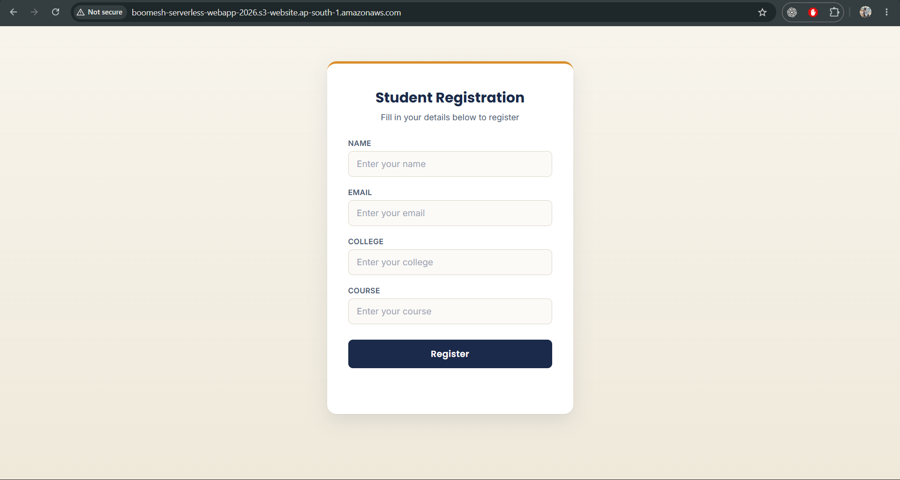
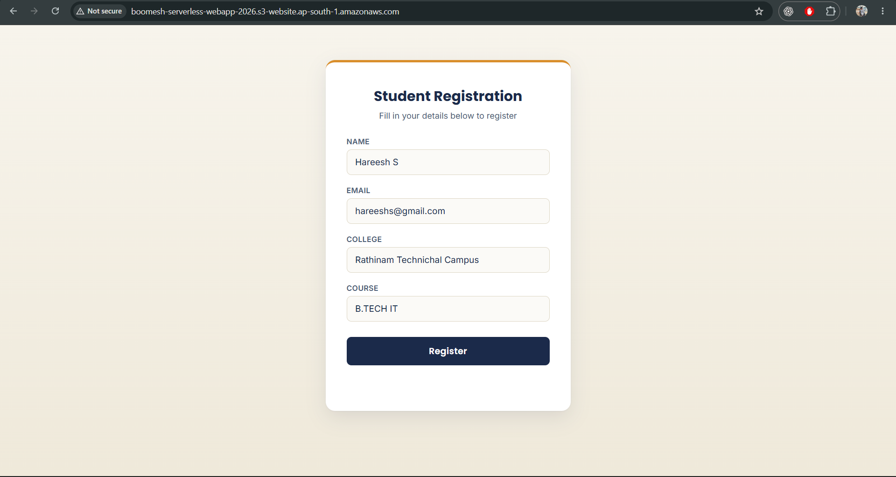
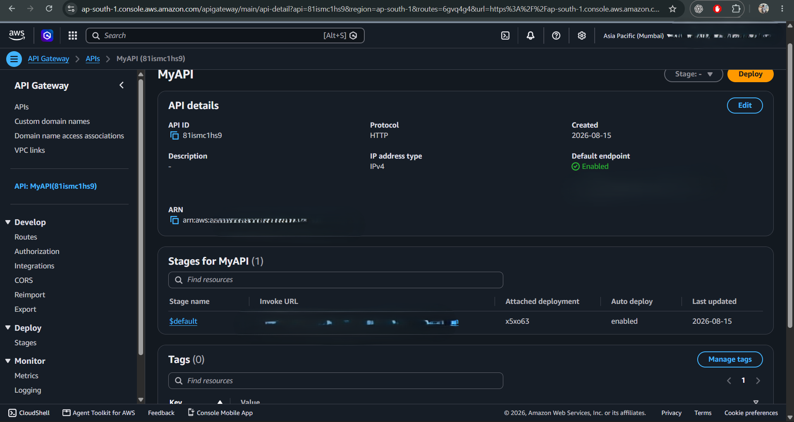
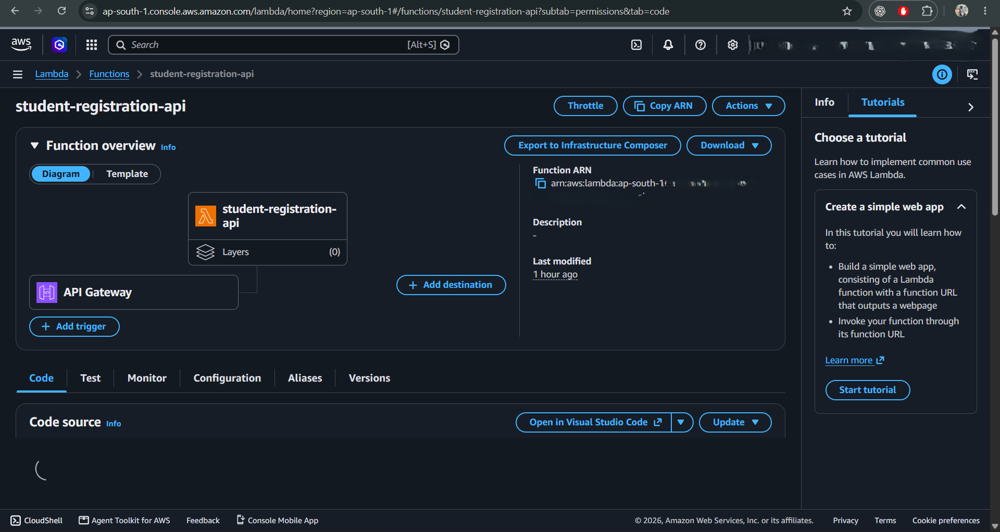
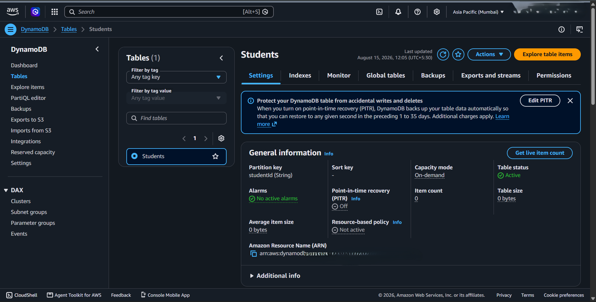
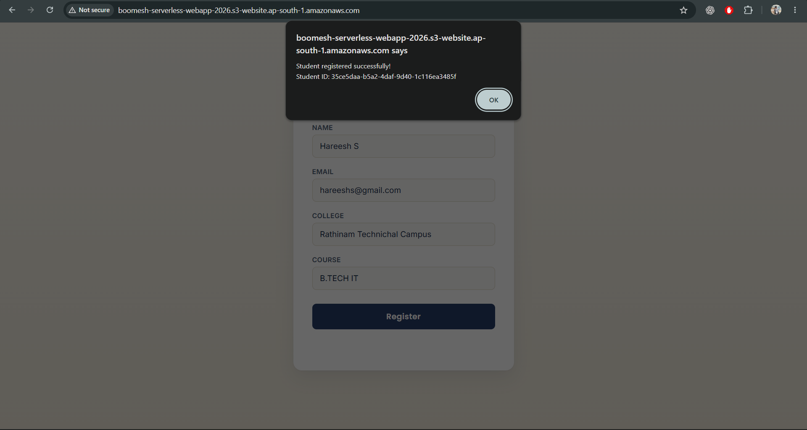

# 🚀 AWS Serverless Student Registration Web App

A fully functional serverless web application built using **Amazon S3, API Gateway, AWS Lambda, and Amazon DynamoDB**.

Users submit student registration details through a web form. The request travels through an API Gateway HTTP endpoint, is processed by a Python Lambda function, and is stored in DynamoDB with an automatically generated unique Student ID.

**🌐 Live Demo:** http://boomesh-serverless-webapp-2026.s3-website.ap-south-1.amazonaws.com/

---

## 📑 Table of Contents

- [Architecture](#️-architecture)
- [AWS Services Used](#️-aws-services-used)
- [Features](#-features)
- [API Reference](#-api-reference)
- [DynamoDB Structure](#️-dynamodb-structure)
- [Lambda Backend](#️-lambda-backend)
- [Project Structure](#-project-structure)
- [Screenshots](#-screenshots)
- [Testing](#-testing)
- [Technologies Used](#️-technologies-used)
- [Future Enhancements](#-future-enhancements)
- [Security Considerations](#-security-considerations)
- [Author & Certifications](#-author--certifications)

---

## 🏗️ Architecture

```text
                    ┌─────────────────────┐
                    │        USER         │
                    │  Student Web Form   │
                    └──────────┬──────────┘
                               │
                               ▼
                    ┌─────────────────────┐
                    │     Amazon S3       │
                    │  Static Web Hosting │
                    │  HTML / CSS / JS    │
                    └──────────┬──────────┘
                               │ HTTP POST
                               ▼
                    ┌─────────────────────┐
                    │  Amazon API Gateway │
                    │   POST /students    │
                    └──────────┬──────────┘
                               │
                               ▼
                    ┌─────────────────────┐
                    │     AWS Lambda      │
                    │   Python Backend    │
                    └──────────┬──────────┘
                               │ PutItem()
                               ▼
                    ┌─────────────────────┐
                    │   Amazon DynamoDB   │
                    │   Students Table    │
                    └─────────────────────┘
```

---

## ☁️ AWS Services Used

| AWS Service           | Purpose                                   |
|------------------------|---------------------------------------------|
| **Amazon S3**          | Hosts the static frontend                 |
| **Amazon API Gateway** | Provides the HTTP API endpoint            |
| **AWS Lambda**         | Processes registration requests           |
| **Amazon DynamoDB**    | Stores student registration data          |
| **AWS IAM**            | Controls permissions between AWS services |

---

## ✨ Features

- Serverless architecture — no servers to manage
- Static website hosting on Amazon S3
- Student registration form with client-side validation
- API Gateway HTTP API with CORS support
- Python Lambda backend
- Automatic unique Student ID generation
- DynamoDB storage with instant reads/writes
- Fully scalable, pay-per-use AWS architecture

---

## 🔌 API Reference

**Endpoint:** `POST /students`
**Base URL:** `https://81ismc1hs9.execute-api.ap-south-1.amazonaws.com`

<details>
<summary><strong>Request & Response examples</strong></summary>

**Request body**
```json
{
  "name": "Boomesh",
  "email": "boomesh@gmail.com",
  "college": "Rathinam Technical Campus",
  "course": "B.Tech IT"
}
```

**Success response**
```json
{
  "message": "Student registered successfully",
  "studentId": "fb4e6001-9e4c-432e-bca2-4ad252a6d0e7"
}
```

</details>

---

## 🗄️ DynamoDB Structure

**Table:** `Students`

| Attribute   | Type   | Description                |
|-------------|--------|-----------------------------|
| `studentId` | String | Unique student identifier (Partition Key) |
| `name`      | String | Student name                |
| `email`     | String | Student email                |
| `college`   | String | College name                 |
| `course`    | String | Course name                  |

---

## ⚙️ Lambda Backend

Written in **Python**. On each request it:

1. Parses the JSON body from API Gateway
2. Generates a unique Student ID (UUID)
3. Writes the item to DynamoDB via `PutItem()`
4. Returns a JSON success/error response

---

## 📂 Project Structure

```text
aws-serverless-web-app/
│
├── database/
│   └── students-table-schema.json   # DynamoDB table schema
│
├── frontend/
│   ├── index.html                   # Registration form
│   ├── script.js                    # Handles form submit + API calls
│   └── style.css                    # Styling
│
├── lambda/
│   └── lambda_function.py           # Python backend logic
│
└── README.md
```

---

## 📸 Screenshots

> Before pushing: double-check no real personal data (names/emails) is visible in the form screenshots — swap in placeholder test data if needed.

Create a `screenshots/` folder at the root of the repo and add these files (same names used below), then commit and push — GitHub renders them automatically.

| Screen                    | Preview |
|-----------------------------|---------|
| S3 Static Website             |  |
| Registration Form (Index Page) |  |
| API Gateway                     |  |
| Lambda Function                   |  |
| DynamoDB Table                      |  |
| Successful Registration               |  |

---

## 🧪 Testing

| Level          | Method                                            |
|-----------------|-----------------------------------------------------|
| **Lambda**       | Invoked directly using a test JSON event             |
| **API Gateway**  | Verified with a live HTTP POST request                |
| **DynamoDB**     | Confirmed successful writes in the `Students` table    |
| **End-to-End**   | Full flow tested from the live S3 website               |

---

## 🛠️ Technologies Used

**Frontend:** HTML5, CSS3, JavaScript
**Backend:** Python, AWS Lambda
**Cloud:** Amazon S3, Amazon API Gateway, Amazon DynamoDB, AWS IAM
**Tools:** Git, GitHub, AWS Management Console

---

## 🚀 Future Enhancements

- [ ] GET API to retrieve registered students
- [ ] Display registered students on the website
- [ ] Search / update / delete student records
- [ ] Server-side input validation
- [ ] Authentication via Amazon Cognito
- [ ] HTTPS + custom domain via CloudFront
- [ ] CloudWatch monitoring and logging
- [ ] Infrastructure as Code (AWS CloudFormation / Terraform)
- [ ] CI/CD via GitHub Actions

---

## 🔐 Security Considerations

This is a learning/demonstration project. For production use, add:

- API authentication (Amazon Cognito)
- Restrictive CORS configuration
- Input validation & rate limiting
- Least-privilege IAM policies
- HTTPS via CloudFront

> ⚠️ **Never commit AWS access keys, secret keys, or `.env` files to GitHub.**

---

## 👨‍💻 Author & Certifications

**R Boomesh**
B.Tech Information Technology Student, Rathinam Technical Campus, Coimbatore

**Certification:**
- [Building Serverless Applications in AWS](.) — LinkedIn Learning, completed by R Boomesh (Aug 2026)
  *Skills: Serverless Computing, Amazon Web Services (AWS)*

**Skills Demonstrated:** AWS Cloud · Serverless Architecture · Python · JavaScript · DynamoDB · API Development · Git & GitHub
